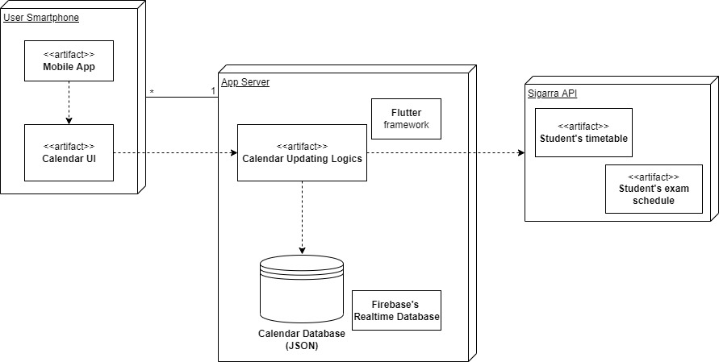

## Architecture and Design

### Logical Architecture
Our calendar system, on its highest level,  is composed of an **activities view**, **interacting buttons** and an **add/editing form view**.
- The activities view is the way our program shows the scheduled activities, in a timetable format.

- There are 5 main interactive buttons: “Edit event”, “Change visibility”, “Add event”, “Next week” and “Previous week”, which allow the user to navigate between weeks.

- The add/editing form view allows the user to fill in the information to add or edit an event

Each one of these components belongs to the **Calendar UI**, which is the interface that allows the user to interact with the calendar.
In order to make our calendar functional, there is a system called **Calendar Updating Logics**. It can be divided into 4 smaller logics modules: **Add activities logics**, **Edit activity logics**, **Delete/Hide activity logics** and **Receive notifications logics**, each one responsible for one specific type of actions.

The calendar updating logics must communicate with the Sigarra Api, which is an external API, in order to import to our calendar the activities related to classes and exams. This database will ensure that each user data is not volatile.

  

### Physical Architecture
Our app’s physical architecture features two entities. The user smartphone, where the app will be installed and the server, where all the information that allows the app to run will be stored.

Regarding the technologies, we will be using flutter because it already is the framework used in uni and is quite easy to learn. We will be using sqlite as well because of its simplicity and, given the fact we only need it to store small pieces of information that cannot be obtained directly from sigarra (information about the extra activities created by the user), it’s more than enough for our needs.

